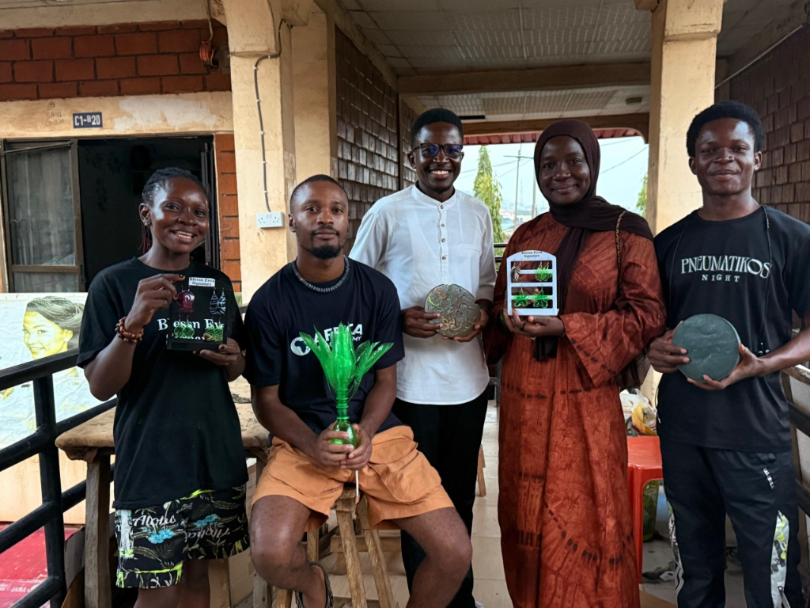
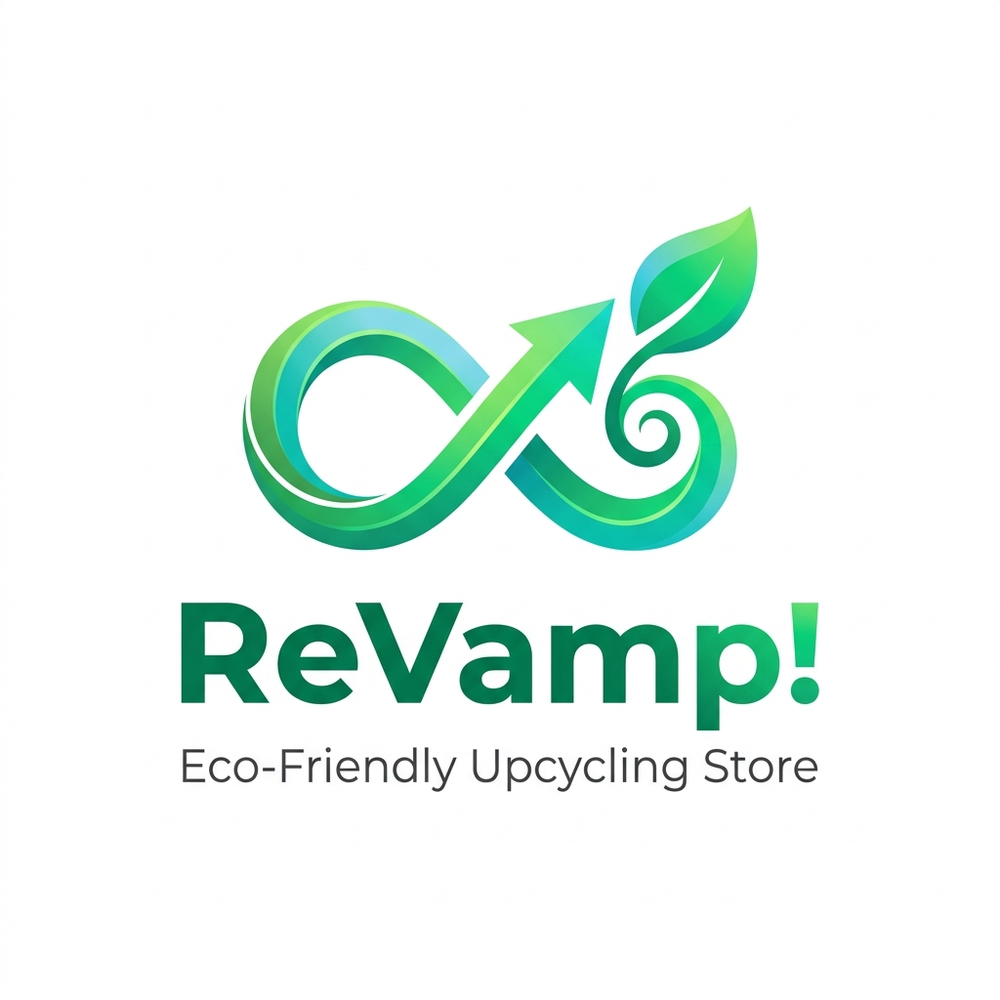
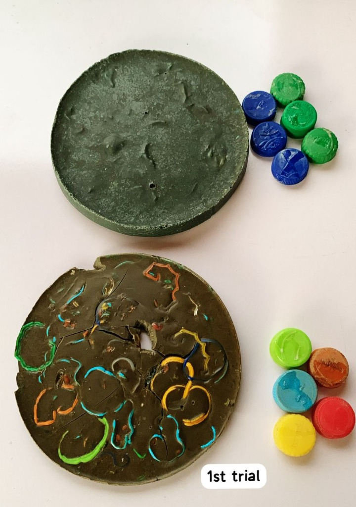

<!-- _class: bg-primary -->

# Plastics REIMAGINED 🌍
## Community Plastic Recovery & Digital Upcycling
**Team BES PlastiTrack**
_DPI-SGP 2.0 Innovation Challenge_

---

## 🤝 Supported By Our Esteemed Partners
Our project directly accelerates the mandates of our core funders and partners:
- **Global Environment Facility (GEF):** Core Funder for grassroots sustainability.
- **UNDP:** Aligning local circular economy efforts with global SDGs.
- **SGP Nigeria:** Supporting community-based environmental initiatives.
- **Digital Peers International (DPI):** Project Incubator driving the SGP 2.0 initiative.

---

## 👥 The Team: BES Leads
- **Blessing Evea Onwe** - Team Lead & Creative Director
- **Bethel Clement** - Asst Team Lead & Product/Data Lead
- **Kenneth Anietie Nyong** - Program Coordinator & Community Engagement
- **Wakala Bilkisu** - Communications Lead & Store Operations

---

## 🚨 The Core Problem
- **Massive Leakage:** Nigeria generates >2.5M tonnes of plastic waste annually; <10% is formally recycled.
- **Informal Settlements:** Communities like *Kuchingoro Garamajiji* and *Durumi* suffer from drainage blockages and open burning.
- **The Gap:** Awareness campaigns fail without **structured incentives** and **visible infrastructure**. Women and youth are sidelined from formal value chains.

---

## 💡 The PlastiTrack Solution
A community-based, youth and women-led recovery system powered by digital tracking and a tangible reward economy.

1. **Recovery Hubs:** Safe, localized collection centers.
2. **Digital Accountability:** Live, transparent tracking of every kilogram (PET, HDPE, PP).
3. **The ReVamp Store:** Closing the loop by turning waste into premium, traceable products.

---

## 📍 Action on the Ground: Pilot Hubs
- **Kuchingoro Garamajiji Hub:** Household aggregation, serving 200+ households, managed by trained women operators.
- **Durumi Informal Settlement Hub:** High-impact intervention working directly with local school eco clubs.

*Result: We move communities from occasional cleanups to daily circular habits.*

---

## 📈 Impact Dashboard
*Real-time data verifying our community impact.*
- **48,640 kg** Total Plastic Recovered
- **1,245** Registered Households
- **₦2.4M+** Issued in Community Rewards
- **60%** Income Transition for Hub Operators

---

## ♻️ The ReVamp! Store

*Premium upcycled products with verifiable traceability.*
- **Waste to Wealth:** We manufacture eco-pavers, modular furniture, and tote bags.
- **Guaranteed Traceability:** Every product shows the exact plastic mix (e.g., HDPE) and the weight diverted from landfills.

---

## 🚀 The Future (Next Steps)
With the Top 10 funding, PlastiTrack will:
1. **Scale Hub Infrastructure:** Upgrade existing hubs with better aggregation tools.
2. **Expand the ReVamp Facility:** Invest in higher-capacity shredders and extruders.
3. **Replication Toolkit:** Package our software and methodology for rapid deployment in other Nigerian states.

---

<!-- _class: bg-primary -->
# Thank You.
### Let's build a circular Nigeria, together.
**Live MVP:** plastitrackbes.vercel.app
**Contact:** safe@plastitrack.org

