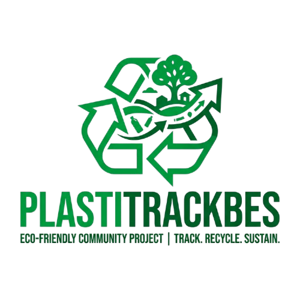
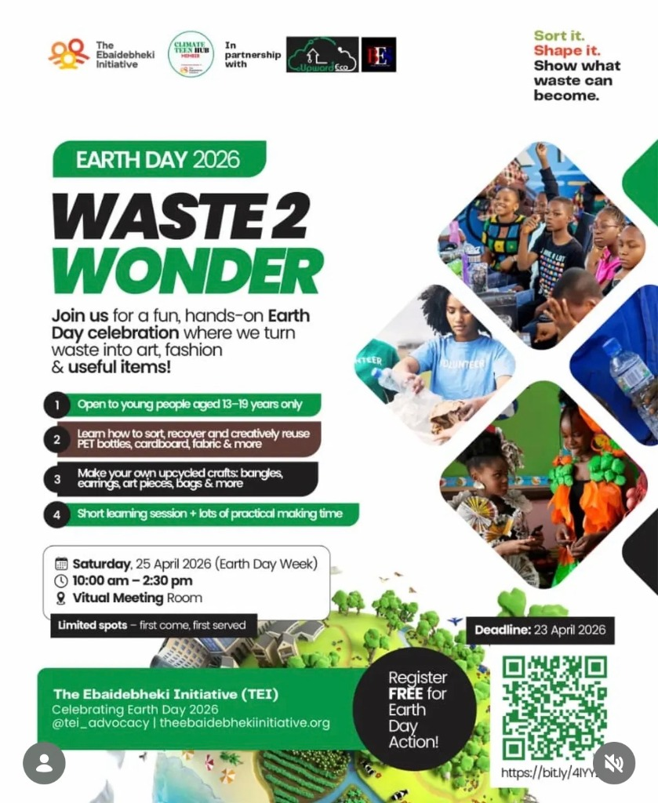
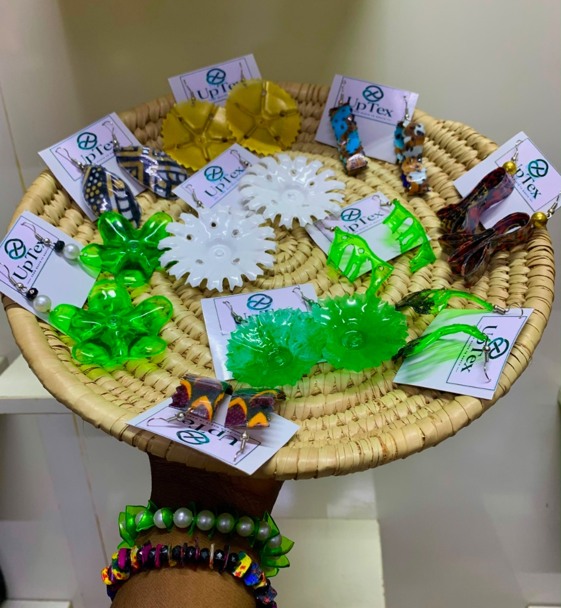
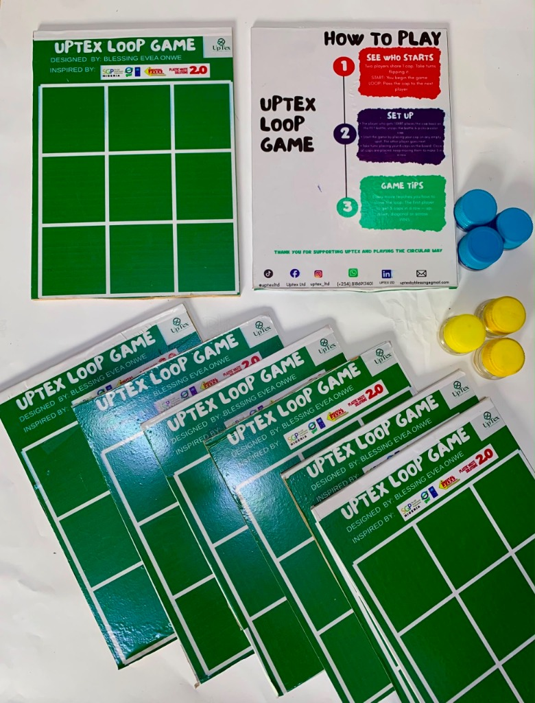
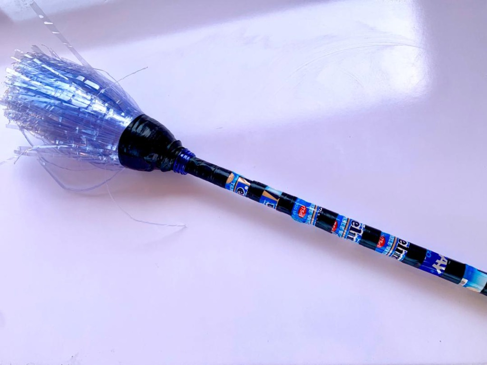

<!-- _class: title-slide -->

# PlastiTrackBES
## Plastics REIMAGINED

**Community Plastic Recovery, Digital Tracking & Youth/Women-Led Upcycling**
*DPI-SGP 2.0 Innovation Challenge (Top 10 Finalist)*

<!-- Speaker Notes: 
Good morning, esteemed members of the panel, organizers, and fellow innovators. I am Blessing Evea Onwe, Team Lead for PlastiTrackBES. Today, we are proud to pitch PlastiTrackBES: a system that leverages digital tracking and decentralized, women-led recovery hubs to turn Abuja's plastic waste crisis into a sustainable, community-wealth-generating circular economy. 
-->

---

## 🚨 The Deep-Rooted Problem

Nigeria generates **>2.5 Million tonnes** of plastic waste annually, with less than **10%** formally recovered.

- **Informal Settlements Suffer:** Communities like *Kuchingoro Garamajiji* and *Durumi* face severe drainage blockages, floods, and toxic open burning.
- **The Missing Link:** Traditional recycling and environmental campaigns fail because there is no **visible community infrastructure** and no **economic incentive** for residents to change habits.
- **Exclusion:** Women and youth—the demographic most impacted by poverty and local environmental degradation—are sidelined from formal green economies.

<!-- Speaker Notes: 
Let's address the hard truth: Nigeria is drowning in plastic waste. Less than 10% is formally recovered, meaning the rest clogs drainage channels, causing severe floods, or gets burnt openly in informal settlements. Why? Because traditional awareness campaigns ask communities to recycle without providing localized, visible infrastructure or direct financial incentives. Furthermore, women and youth are completely sidelined from the economic benefits of this value chain.
-->

---

<!-- _class: split -->

## 💡 Our Comprehensive Solution

**PlastiTrackBES** closes the loop by connecting digital accountability with localized action.

1. **Decentralized Recovery Hubs:** Clean, safe collection spaces built right inside the target communities, managed entirely by trained local women.
2. **Digital Accountability:** Live, transparent tracking of every single kilogram of PET, HDPE, and PP recovered from the waste stream.
3. **The ReVamp! Store:** A closed-loop marketplace transforming sorted plastic waste into beautiful, premium, and traceable consumer goods.

<!-- Speaker Notes: 
Our solution, PlastiTrackBES, is an integrated circular ecosystem. First, we deploy decentralized recovery hubs directly in informal settlements, operated by women. Second, we verify and log every gram of plastic digitally to build public data trust. Third, we close the loop using our ReVamp! Store, converting local waste into premium, high-demand, and fully traceable products.
-->

---

## 👥 The BES Leadership Team
*A powerhouse team combining data analytics, community trust, and creative upcycling.*

- **Blessing Evea Onwe** - Team Lead & Creative Director
  *Expert upcycler leading design aesthetics, hub onboarding, and workshop operations.*
- **Bethel Clement** - Assistant Team Lead & Product/Data Lead
  *Software engineer managing platform code, digital tracking databases, and green computing integrations.*
- **Kenneth Anietie Nyong** - Program Coordinator & Community Engagement
  *Ecosystem coordinator driving relationships with local governments and eco-clubs.*
- **Wakala Bilkisu** - Communications Lead & Store Operations
  *Managing consumer customer success, order logistics, and social impact outreach.*

<!-- Speaker Notes: 
A system is only as strong as its execution team. Our leadership group combines deep technical, creative, and community management expertise. I lead the creative and design direction; Bethel Clement handles our software development, digital tracking database, and green computing; Kenneth coordinates community and partner engagement; and Wakala operates ReVamp! Store communications and order logistics.
-->

---

## 🤝 Supported By Global Mandates

Our platform is structured to execute the exact environment and development mandates of our funders and program partners:

- **Global Environment Facility (GEF):** Driving community-led climate action, biodiversity conservation, and waste-sector pollution reduction.
- **UNDP:** Integrating grassroots recycling initiatives directly with the UN Sustainable Development Goals (SDGs 1, 5, 8, 12, 13).
- **SGP Nigeria (Small Grants Programme):** Enabling localized environmental protection models to scale through seed capital and advisory.
- **Digital Peers International (DPI):** Program incubator driving the DPI-SGP 2.0 Innovation Challenge to scale digital circular models.

<!-- Speaker Notes: 
PlastiTrackBES is proud to be incubated and supported by prestigious institutions. We are executing the core mandates of SGP Nigeria and the Global Environment Facility by driving community environmental protection, aligning with the UNDP's Sustainable Development Goals for gender equality and circular economies, and scaling our digital framework through the guidance of Digital Peers International.
-->

---

## 🤝 Local Execution Partners & Ecosystem

*Multi-stakeholder collaboration to secure operational clearance, spaces, and green supply chains.*

- **Abuja Environmental Protection Board (AEPB):** Partnership on waste aggregation logistics, official permits, and aligning with Abuja's municipal sanitation master plan.
- **AMAC Municipal Council:** Local government endorsement and lease of safe, permanent hub locations in the Kuchingoro and Durumi sectors.
- **Local School Eco-Clubs:** Partnerships with secondary schools to embed recycling habits in preteens and teens through active collection drives and inter-class rewards.

<!-- Speaker Notes: 
Ecosystem integration is key to sustainability. We partner with the Abuja Environmental Protection Board to ensure municipal compliance and streamline waste logistics. The AMAC Municipal Council provides us with physical locations for our recovery hubs, while local school Eco-Clubs act as critical waste collection and behavioral change centers for preteens and teens.
-->

---

## 📍 Track Record: Successful Sensitization

**Phase 1: Preteen & Teen Creative Upcycling**
We didn't start with code; we started with minds. Our initial pilot focused on educating the youth on environmental sustainability.

We trained preteens and teens in Kuchingoro on creative upcycling—turning plastic waste into wall-decors, bracelets, and accessories. <strong>Why?</strong> Because when youth see that their trash can clean their neighborhood <em>and</em> be crafted into premium products, they adopt lifelong recycling behaviors.

<!-- Speaker Notes: 
In our initial phase, we focused on preteens and teens. We ran sensitization and creative upcycling bootcamps where they learned to turn raw PET bottles and caps into premium wall decor and fashion pieces. Showing them that waste holds economic and artistic value changed their perspective and secured community-wide trust.
-->

---

<!-- _class: split -->

## 🌍 Milestone: World Earth Day 2026

**Waste 2 Wonder Partnership**

In partnership with the **Climate Teen Hub**, we commemorated World Earth Day 2026 with a massive global and local sensitization campaign.

- **Global & Local Outreach:** Taught hundreds of teens across Nigeria and international hubs.
- **Diverting PET Bottles:** Focused on PET plastic—the highest contributor to local drainage clogging and pollution.
- *Proof of Concept:* Transformed hundreds of discarded plastic bottles into eco-art pieces and structural pavers on live streams.

<!-- Speaker Notes: 
For World Earth Day 2026, we partnered with the Climate Teen Hub to run the 'Waste 2 Wonder' campaign. We engaged hundreds of youth, focusing on PET bottles. This live, hands-on event proved that we could mobilize communities to aggregate plastic and feed it directly into our upcycling pipeline.
-->

---

## 🏆 Media & National Recognition

*Our community circular model is already gaining traction on the national stage:*

- **Award Nomination:** PlastiTrackBES has been officially nominated for an Abuja environmental impact award, recognizing grassroots innovation.
- **National Radio Feature (Kiss FM):** Our Assistant Team Lead, Bethel Clement, was invited by Kiss FM to speak on how digital tracking can solve urban waste, broadcasting our model to thousands of listeners across Nigeria.

*We have moved from an initial concept to a validated, publicly recognized initiative.*

<!-- Speaker Notes: 
We are gaining national momentum. PlastiTrackBES was nominated for an environmental impact award in Abuja. Furthermore, our Assistant Team Lead discussed our circular tracking technology and community incentive model on Kiss FM, showcasing our solution to thousands of listeners and building solid brand credibility.
-->

---

<!-- _class: impact -->

## 📈 Platform Metrics & Data

*Real-time verified data displaying the environmental and social impact of our platform.*

  

    <h1>48.6k</h1>
    
Kg Recovered

  

  

    <h1>1.2k</h1>
    
Households

  

  

    <h1>₦2.4M</h1>
    
Rewards Issued

  

  <strong>60% Income Increase</strong> generated for our trained women hub operators through aggregation margins and upcycling production.

<!-- Speaker Notes: 
Our digital dashboard provides full transparency. To date, our hubs have successfully recovered over 48.6 thousand kilograms of plastic, registered 1,200 households, and distributed over 2.4 million Naira in rewards. Crucially, we have generated a 60% income increase for our trained women hub operators.
-->

---

<!-- _class: split -->

## ♻️ ReVamp! Store: UpTex June Arrivals

Our newly rebranded **UpTex** line features premium upcycled products with exact plastic diverted calculations:

- **UpTex Plastic Earrings:** Hand-crafted eco-jewelry mounted on branded UpTex presentation cards. (₦2,500)
  *8g diverted (~1-2 caps) | 12g CO₂ saved*
- **UpTex Plastic Wristbands (Wristbeads):** Vibrant bands cut from PET bottle offcuts with pearl and glass beads. (₦1,500)
  *12g diverted (~1 bottle) | 18g CO₂ saved*
- **UpTex Artist Palette + Brush Set:** 5-in-1 paint station with compressed HDPE brush holder. (₦5,000)
  *185g diverted (~4-5 bottles) | 277g CO₂ saved*
- **UpTex Table Organizer:** Fused twin green PET bottles wrapped in gold tape on an UpTex base. (₦5,000)
  *120g diverted (~2 bottles) | 180g CO₂ saved*

<!-- Speaker Notes: 
In June 2026, we rebranded our premium upcycled catalog to 'UpTex'. These products sit on top of our store. They range from hand-crafted UpTex plastic earrings mounted on collectible presentation cards, to PET plastic wristbands and wristbeads, and artist palette sets. For every item, we provide accurate plastic weight diverted and CO2 savings estimates.
-->

---

<!-- _class: split -->

## 🎮 Educational Game: The Loop Game

Our flagship circular-economy edutainment board game driving positive behaviour change in youth:

- **Interactive Edutainment:** Uses upcycled HDPE bottle caps as game tokens on a 3x3 play grid.
- **Storage Can Included:** Each board is crafted to house a dedicated storage container for the 6 caps (3 blue, 3 yellow).
- **Price:** ₦7,000 per board set.
- **Impact Estimate:** Diverts **30g of HDPE** plastic caps & saves **45g of CO₂** per game set.
- *Closing the loop through play!*

<!-- Speaker Notes: 
We also launched a unique educational product: The Loop Game. Priced at N7,000, it is a 3x3 grid game that uses color-sorted upcycled HDPE bottle caps as tokens to teach circularity to youth. Each set comes with a custom board and a storage can for its 6 caps, diverting 30 grams of high-density plastic per board.
-->

---

<!-- _class: split -->

## ♻️ ReVamp! Store: Original BES Collection

Our original BES-branded products continue to provide affordable upcycled solutions and robust environmental offsets:

- **Green & Mixed Trial Discs:** Highly compressed HDPE/PP testing discs for future eco-paving. (₦5,000 - ₦5,500)
  *1.8kg - 2.1kg diverted (~70-80 caps) | Up to 3.1kg CO₂ saved*
- **Recycled Keychains:** Durable daily accessories. (₦2,000)
  *10g diverted (~0.1 PET bottle) | 15g CO₂ saved*
- **Upcycled Earrings (BES):** Elegant PET jewelry. (₦3,000)
  *8g diverted (~1-2 fragments) | 12g CO₂ saved*
- **Recycled Bangles:** Fashionable HDPE bands. (₦4,500)
  *200g diverted (~5-7 bottle sections) | 300g CO₂ saved*
- **PET Broom:** Repurposed PET bristles with HDPE handle. (₦10,000)
  *500g diverted (~35-40 bottles) | 750g CO₂ saved*
- **PET Plant Décor:** Sustainable indoor greenery. (₦3,000)
  *300g diverted (~8-10 bottles) | 450g CO₂ saved*

<!-- Speaker Notes: 
Below our UpTex arrivals, we display the original BES collection. This includes our heavy-duty Green and Mixed Trial Discs, which compress up to 2.1 kilograms of plastic for modular paving tests; daily-use keychains and bangles; and our highly popular PET Broom at N10,000, which diverts 500 grams of plastic from landfills and lasts three times longer than traditional brooms.
-->

---

## 🔗 Verified Traceability & Real-World Tracking

*We bridge the gap between digital claims and real-world recycling through a public ledger:*

1. **Collection (Hub):** Collector drops plastic at Kuchingoro/Durumi. Weighing is logged.
2. **Database Logging:** System creates a unique entry and issues points to the contributor's account.
3. **Depot Processing:** Plastic sorted by resin code, cleaned, and shredded/melted at the workshop.
4. **UpTex Crafting:** Products are manufactured and assigned a final tracing tracking ID.
5. **Secure Order Checkout:** Customer purchases item. Order matches the exact raw material ID.
6. **Timeline Stepper:** Customer searches order ID (e.g. `PT-642189`) to view the exact dates, locations, and operators involved in their product's journey.

<!-- Speaker Notes: 
Our traceability model is not hypothetical; it is mapped in real-time. When a customer purchases a product from the ReVamp! Store, they receive a tracking number. Entering this tracking number on our website displays a vertical stepper timeline detailing the collection date, the logging officer, the sorting lead, the upcycling craft team, and the final CO2 savings.
-->

---

## 📱 Live MVP Web Layout & User Experience

*A beautiful, responsive web interface built using Next.js, React, and Tailwind CSS:*

- **Landing Page & Eco-Calculator:** Allows visitors to select plastic type and slide weight to see CO₂ and landfill volume savings in real time.
- **Dynamic Impact Dashboard:** Aggregates real-time municipal metrics, active household enrollments, and hub leaderboard standings.
- **Interactive Traceability Page:** Search engine that queries our Supabase database to display a vertical timeline of custody.
- **ReVamp! Store Checkout:** Form requesting delivery details, bank transfer credentials (FCMB / Blessn Evea Signature), and payment receipt uploads.

<!-- Speaker Notes: 
Our live MVP is fully deployed and interactive. It features a responsive landing page with an Eco Calculator that lets users slide weight to see instant environmental metrics. The public dashboard tracks real-time data, and our secure checkout form provides FCMB transfer details and payment receipt uploads to keep order flow smooth.
-->

---

## 💼 Sustainable Business Model

*Multiple revenue streams to ensure long-term financial independence and remove grant reliance:*

- **Upcycled Product Sales (B2C & B2B):** Selling premium upcycled items (UpTex earrings, Table organizers, Eco-Pavers, Brooms) to eco-conscious consumers and corporate entities for branded ESG gifting.
- **Raw Material Supply:** Selling clean, color-sorted PET flakes and crushed HDPE regrind to large-scale plastic recycling and manufacturing plants.
- **Traceability as a Service (TaaS):** Subscription dashboard for B2B consumer brand partners to track their Extended Producer Responsibility (EPR) compliance credits live on our ledger.

<!-- Speaker Notes: 
To ensure financial independence, we have built a multi-stream business model. We sell upcycled products directly to consumers and B2B clients for ESG gifting. We supply clean, shredded plastic flakes to industrial recyclers. Finally, we offer Traceability-as-a-Service, letting consumer brands subscribe to track and verify their Extended Producer Responsibility compliance points.
-->

---

## 🔄 Financial Sustainability & Exit Plan

*Transitioning from pilot seed funding to self-sustaining municipal circular operations:*

- **18-Month Break-Even:** Moving to a self-funded model sustained by high-margin upcycled goods and raw material supply agreements.
- **EPR Beverage Integration:** Collaborating with beverage manufacturing coalitions to act as their licensed community aggregation and recovery partner.
- **Verifiable Carbon & Plastic Offsets:** Packaging our digital tracking ledger into local plastic credits to sell to corporate carbon offset buyers in West Africa.

<!-- Speaker Notes: 
Our financial exit plan targets self-sustainability within 18 months. We will break even by scaling our product sales and securing recurring raw material contracts. Furthermore, we are positioning PlastiTrackBES as a licensed Extended Producer Responsibility partner for beverage coalitions, and monetizing our verified plastic diversion data into local green offset certificates.
-->

---

## 🍃 Eco-Friendly Green Computing MVP

*Green computing principles applied directly to our digital architecture to eliminate digital carbon footprint:*

- **Low-Carbon Hosting:** PlastiTrackBES is hosted in cloud regions operating on 100% renewable energy.
- **Client-Side Eco Mode Toggle:** A custom setting that disables all resource-intensive CSS animation loops, reducing device CPU and battery draw by up to 25%.
- **Next.js Static Compilation:** Server rendering overhead is reduced to zero by pre-rendering pages (SSG/ISR), preventing continuous database compute waste.
- **OLED Energy Savings:** Built-in high-contrast dark theme reduces screen power consumption by up to 60% on mobile OLED/AMOLED displays.

<!-- Speaker Notes: 
In line with our environmental ethics, our technology is eco-friendly. The PlastiTrackBES website is hosted on renewable energy servers. It features Next.js static compilation to minimize server overhead and a client-side Eco Mode that users can toggle to disable heavy animations, saving device CPU cycles and mobile battery power by up to 25%.
-->

---

## 🚀 The Future: Scaling PlastiTrackBES

*With the DPI-SGP 2.0 Top 10 funding, we will scale our impact:*

1. **Expand Hub Infrastructure:** Deploy commercial-grade digital scales, sorting screens, and heavy-duty collection bins to our Kuchingoro and Durumi hubs.
2. **ReVamp Workshop Investment:** Procure industrial shredders and sheet-press machinery to scale from accessories to modular eco-furniture.
3. **Circular Replication Toolkit:** Package our software database, Google Auth onboarding flow, and community handbook to license and replicate the model across other states in Nigeria.

<!-- Speaker Notes: 
Looking forward, our expansion plans focus on scaling physical hub infrastructure with commercial scales and bins, upgrading our ReVamp workshop with industrial shredders and sheet-press machines, and packaging our digital tracking software and hub handbook into a replication toolkit to expand across all 36 states of Nigeria.
-->

---

<!-- _class: split -->

## 📱 Scan & Explore our Live MVP

*Scan the brand-aligned QR code below to experience our live platform, tracker, and store.*

- **Live URL:** [plastitrackbes.vercel.app](https://plastitrackbes.vercel.app)
- **Interactive Features:** 
  - Dynamic Impact Calculator
  - Live Traceability Search (PT-XXXXXX)
  - Dark Mode & Client-side Eco Mode Toggle
  - ReVamp! Store Secure Checkout
- *Proudly circular, verified, and live.*

<!-- Speaker Notes: 
We invite you to scan this brand-aligned QR code or visit plastitrackbes.vercel.app on your devices right now. You can test the Eco Calculator, query tracking IDs on the Traceability page, explore the ReVamp! Store, and toggle Eco Mode. Our MVP is fully functional, verified, and live today.
-->

---

<!-- _class: title-slide -->

# Thank You.

### Let's Build a Circular Nigeria, Together.

**Live Platform:** [plastitrackbes.vercel.app](https://plastitrackbes.vercel.app)
**Contact:** safe@plastitrackbes.org

*Proudly presented by Team BES.*

<!-- Speaker Notes: 
Thank you very much, members of the panel, for your time and dedication to sustainable innovation. We are Team BES, and we look forward to working with SGP Nigeria, GEF, UNDP, and Digital Peers International to build a cleaner, greener, and circular Nigeria. We are now open to your questions.
-->
